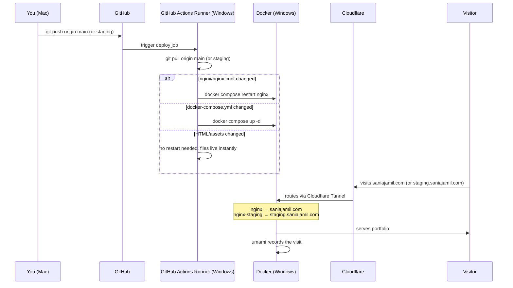

# saniajamil.com

Personal portfolio and project feed. Live at [saniajamil.com](https://saniajamil.com).

## Environments

| Branch | URL | Purpose |
|--------|-----|---------|
| `main` | [saniajamil.com](https://saniajamil.com) | Production |
| `staging` | [staging.saniajamil.com](https://staging.saniajamil.com) | Preview before merging |

## Stack

- Static HTML/CSS — no frameworks
- Nginx (Docker) — serves the files
- Cloudflare Tunnel — public access without port forwarding, free SSL
- GitHub Actions (self-hosted runner) — auto-deploys on every push
- Umami — self-hosted analytics at `analytics.saniajamil.com`

## Infrastructure

```
Mac (dev)
  → GitHub
    ├── push to main     → Runner → git pull → nginx restart (if needed) → saniajamil.com
    └── push to staging  → Runner → git pull → nginx-staging restart     → staging.saniajamil.com

Umami analytics → analytics.saniajamil.com (always on, same server)
```

## CI/CD Pipeline



## Docker containers

| Container | Image | Purpose |
|-----------|-------|---------|
| `playground-nginx-1` | nginx:alpine | Serves production files |
| `playground-nginx-staging-1` | nginx:alpine | Serves staging files |
| `playground-cloudflared-1` | cloudflare/cloudflared | Cloudflare Tunnel |
| `playground-umami-1` | umami:postgresql-latest | Analytics dashboard |
| `playground-umami-db-1` | postgres:15-alpine | Umami database |

## Server setup

- Windows home server running Docker Desktop with WSL
- GitHub Actions self-hosted runner (runs as a scheduled task, starts on boot)
- Production files served from the `main` branch clone
- Staging files served from the `staging` branch clone

## Branch rules

| Change type | Branch |
|-------------|--------|
| Content (`index.html`, `resume.pdf`, copy) | `staging` first, then merge to `main` |
| Infrastructure (`docker-compose.yml`, nginx, workflows) | `main` directly |

## Adding a new app

To host a new app at a subdomain (e.g. `app.saniajamil.com`):

1. Add a new service to `docker-compose.yml`
2. Add a new config file in `nginx/` (if nginx-based)
3. In Cloudflare Zero Trust → Networks → Tunnels → `home-server` → Routes → Add route → Published application → set destination and service URL
4. Run `docker compose up -d` on the server

## Troubleshooting

**Subdomains return 502 after a deploy**

Happens when `docker-compose.yml` changes trigger a cloudflared restart. Cloudflare briefly caches the 502s from the ~30 second reconnect window. Fix: wait 2-3 minutes and reload. If it persists, go to Cloudflare → saniajamil.com → Caching → Purge Cache → Purge Everything. For persistent cache issues, enable Development Mode (Caching → Configuration) — it bypasses all caching for 3 hours.

## Security

Nginx blocks access to:
- `.git` and all hidden files/folders
- Sensitive file types: `.json`, `.yml`, `.yaml`, `.env`, `.py`, `.sh`, `.sql`

## Local development

Open `index.html` in your browser — no build step needed.

## Workflow

1. Make changes on a feature branch
2. Push to `staging` — auto-deploys to `staging.saniajamil.com`
3. Check it looks right
4. Merge to `main` — auto-deploys to `saniajamil.com`
