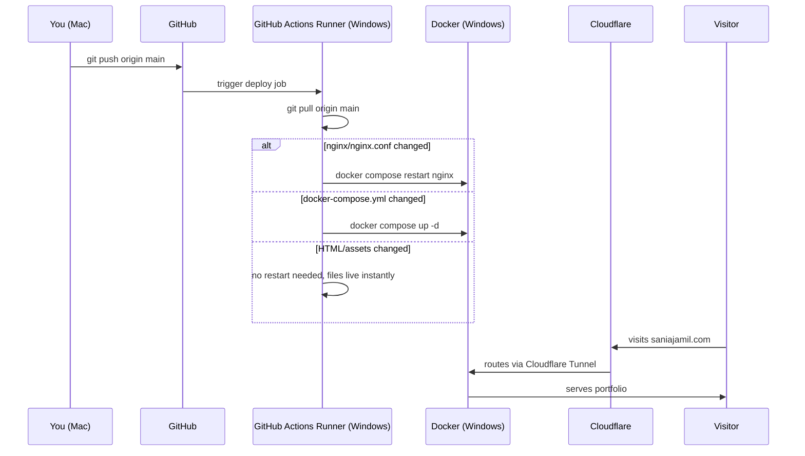

# saniajamil.com

Personal portfolio and project feed. Live at [saniajamil.com](https://saniajamil.com).

## Stack

- Static HTML/CSS — no frameworks
- Nginx (Docker) — serves the files
- Cloudflare Tunnel — public access without port forwarding, free SSL
- GitHub Actions (self-hosted runner) — auto-deploys on every push to `main`

## Infrastructure

```
Mac (dev)
  → GitHub (source of truth)
    → Self-hosted Actions Runner (Windows server)
      → git pull + docker compose restart nginx
        → Nginx container (serves files)
          ← Cloudflare Tunnel (public access)
            ← saniajamil.com (visitor)
```

## CI/CD Pipeline



## Server setup

- Windows home server at `192.168.50.11`
- Docker Desktop with WSL enabled
- GitHub Actions runner installed at `C:\Users\Hello\actions-runner\actions-runner`
- Runner runs as a Windows scheduled task (starts on boot, no terminal needed)
- Cloudflare Tunnel token configured in `docker-compose.yml`

## Adding a new app

To host a new app at a subdomain (e.g. `app.saniajamil.com`):

1. Add a new service to `docker-compose.yml`
2. Add a new `server {}` block to `nginx/nginx.conf`
3. Add a new public hostname in Cloudflare Zero Trust → Tunnels → `home-server`
4. Run `docker compose up -d` on the server

## Security

Nginx blocks access to:
- `.git` and all hidden files/folders
- Sensitive file types: `.json`, `.yml`, `.yaml`, `.env`, `.py`, `.sh`, `.sql`

## Local development

Open `index.html` in your browser — no build step needed.

## Deploying changes

Just push to `main`. The Actions runner picks it up automatically within seconds.
