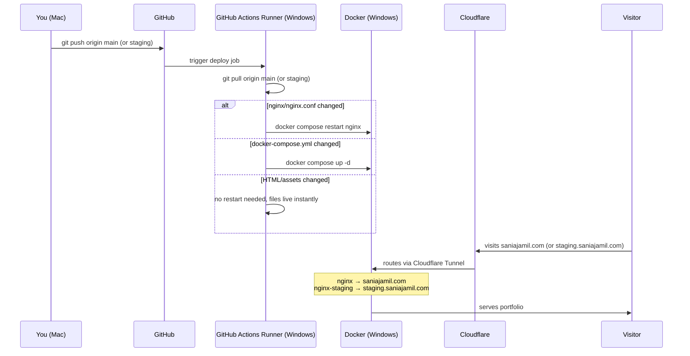

# saniajamil.com

Personal portfolio and project feed. Live at [saniajamil.com](https://saniajamil.com).

## Environments

| Branch | URL | Purpose |
|--------|-----|---------|
| `main` | [saniajamil.com](https://saniajamil.com) | Production |
| `staging` | [staging.saniajamil.com](https://staging.saniajamil.com) | Preview before merging |

## Stack

- Static HTML/CSS — no frameworks
- Nginx (Docker) — serves the files
- Cloudflare Tunnel — public access without port forwarding, free SSL
- GitHub Actions (self-hosted runner) — auto-deploys on every push

## Infrastructure

```
Mac (dev)
  → GitHub
    ├── push to main     → Runner → git pull → nginx restart (if needed) → saniajamil.com
    └── push to staging  → Runner → git pull → nginx-staging restart     → staging.saniajamil.com
```

## CI/CD Pipeline



## Docker containers

| Container | Image | Purpose |
|-----------|-------|---------|
| `playground-nginx-1` | nginx:alpine | Serves production files |
| `playground-nginx-staging-1` | nginx:alpine | Serves staging files |
| `playground-cloudflared-1` | cloudflare/cloudflared | Cloudflare Tunnel |

## Server setup

- Windows home server at `192.168.50.11`
- Docker Desktop with WSL enabled
- GitHub Actions runner at `C:\Users\Hello\actions-runner\actions-runner`
- Runner runs as a Windows scheduled task (starts on boot, no terminal needed)
- Production files at `C:\Users\Hello\home_server\playground` (main branch)
- Staging files at `C:\Users\Hello\home_server\staging` (staging branch)

## Adding a new app

To host a new app at a subdomain (e.g. `app.saniajamil.com`):

1. Add a new service to `docker-compose.yml`
2. Add a new config file in `nginx/`
3. Add a new public hostname in Cloudflare Zero Trust → Tunnels → `home-server`
4. Run `docker compose up -d` on the server

## Security

Nginx blocks access to:
- `.git` and all hidden files/folders
- Sensitive file types: `.json`, `.yml`, `.yaml`, `.env`, `.py`, `.sh`, `.sql`

## Local development

Open `index.html` in your browser — no build step needed.

## Workflow

1. Make changes on a feature branch
2. Push to `staging` — auto-deploys to `staging.saniajamil.com`
3. Check it looks right
4. Merge to `main` — auto-deploys to `saniajamil.com`
