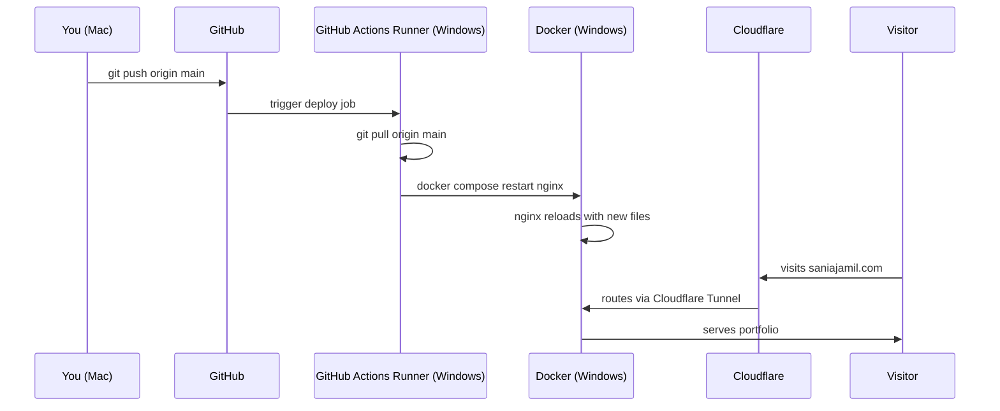

# saniajamil.com

Personal portfolio and project feed. Live at [saniajamil.com](https://saniajamil.com).

## Stack

- Static HTML/CSS — no frameworks
- Nginx (Docker) — serves the files
- Cloudflare Tunnel — public access without port forwarding
- GitHub Actions (self-hosted runner) — auto-deploys on push to `main`

## CI/CD Pipeline

## Local development

Open `index.html` in your browser.
