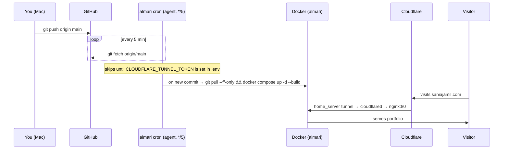

# saniajamil.com

Personal portfolio and project feed. Live at [saniajamil.com](https://saniajamil.com).

## What's here

| Path | What it is |
|------|-----------|
| `index.html` | Home page — a terminal-style project grid (demos + case studies), rendered from a `projects` array in the page |
| `about.html` | About & Résumé — bio, experience, skills, education, contact |
| `resume.pdf` | Downloadable résumé, synced from a Google Doc (see below) |
| `nginx/` | nginx configs for production + staging |
| `docker-compose.yml` | The stack (nginx, cloudflared, jobhunt) |
| `apps/jobhunt/` | "naukri" job-hunt app — local-only at `naukri.almari` (see `CLAUDE.md`) |
| `scripts/sync-resume.mjs` | Pulls the latest résumé export from the Google Doc |
| `.github/workflows/sync-resume.yml` | Weekly résumé auto-sync |

## Stack

- Static HTML/CSS/JS — no framework, no build step
- Nginx (Docker) — serves the files
- Cloudflare Tunnel (`home-server`) — public access without port forwarding, free SSL
- Deployed on **almari** (Linux home server) as an external repo, auto-deployed by a 5-min cron

## Deploy

**Just push to `main`.** saniajamil.com is hosted on almari as an external repo
(`/opt/almari/external/playground`). The `agent` crontab polls `origin/main` every 5 minutes
and rebuilds when it advances — there is no GitHub Actions deploy step.


```mermaid
sequenceDiagram
    participant You as You (Mac)
    participant GitHub
    participant Cron as almari cron (agent, */5)
    participant Docker as Docker (almari)
    participant CF as Cloudflare
    participant Visitor

    You->>GitHub: git push origin main
    loop every 5 min
        Cron->>GitHub: git fetch origin/main
    end
    Note over Cron: skips until CLOUDFLARE_TUNNEL_TOKEN is set in .env
    Cron->>Docker: on new commit → git pull --ff-only && docker compose up -d --build

    Visitor->>CF: visits saniajamil.com
    CF->>Docker: home_server tunnel → cloudflared → nginx:80
    Docker->>Visitor: serves portfolio
```

Deploy script: `/home/agent/scripts/deploy-playground.sh` on almari
(logs → `/home/agent/logs/playground-deploy.log`). Force an immediate deploy or tail the log:

```bash
ssh agent@192.168.50.11 -p 2222 "/home/agent/scripts/deploy-playground.sh"
ssh agent@192.168.50.11 -p 2222 "tail -20 /home/agent/logs/playground-deploy.log"
```

## Résumé — sourced from a Google Doc

The Google Doc is the source of truth. `resume.pdf` is its exported PDF, refreshed by
`scripts/sync-resume.mjs`. A GitHub Actions workflow (`sync-resume.yml`) runs **weekly** on a
GitHub-hosted runner, commits `resume.pdf` if it changed, and pushes to `main` — the almari cron
then publishes it. Run it by hand anytime:

```bash
node scripts/sync-resume.mjs
```

The Doc must stay shared "Anyone with the link can view" for the public export to work.

## Docker containers

| Container | Image | Purpose |
|-----------|-------|---------|
| `playground-nginx-1` | nginx:alpine | Serves production files (`saniajamil.com`) |
| `playground-nginx-staging-1` | nginx:alpine | Serves staging files (`staging.saniajamil.com`) |
| `playground-cloudflared-1` | cloudflare/cloudflared | Cloudflare Tunnel connector |
| `playground-jobhunt-1` | built from `apps/jobhunt` | naukri job-hunt app (`naukri.almari`, local-only) |

> Analytics (Umami) was **decommissioned** and removed from the stack. Re-add a live analytics tag
> in `index.html` + `about.html` before pointing any `analytics.*` route at a service again.

## Adding a new app at a subdomain

1. Add a service to `docker-compose.yml`
2. Add an `nginx/` config (if nginx-based) or Traefik labels (for `*.almari` local apps)
3. Cloudflare Zero Trust → Networks → Tunnels → `home-server` → add a public hostname route → service URL
4. Push to `main` (the cron redeploys), or run `docker compose up -d` on almari

## Staging

`staging.saniajamil.com` is routed through the tunnel to `nginx-staging`, but there is no staging
auto-deploy anymore (the old staging-branch runner was retired). It currently serves an empty mount
(`../staging`) — seed that directory on almari or drop the service + route if unused.

## Security

Nginx blocks access to `.git` / hidden files and sensitive types (`.json`, `.yml`, `.yaml`, `.env`,
`.py`, `.sh`, `.sql`).

## Local development

Open `index.html` in a browser — no build step. To exercise nginx/tunnel behavior, run the stack
with Docker locally, or preview via a static server.

## Troubleshooting

**Public URL returns 530** — the tunnel has no healthy connector. Check the `playground-cloudflared-1`
logs on almari for `Registered tunnel connection` (the QUIC pre-check FAILs at startup are a known
false alarm and can be ignored if a connection registers right after). Confirm
`CLOUDFLARE_TUNNEL_TOKEN` is set in `/opt/almari/external/playground/.env`.

**Subdomain returns 502 shortly after a deploy** — cloudflared briefly reconnects when
`docker-compose.yml` changes. Wait 1–2 minutes; if it persists, purge the Cloudflare cache.
